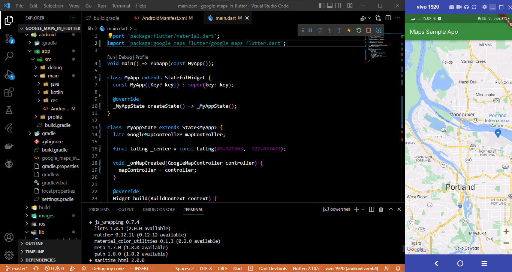
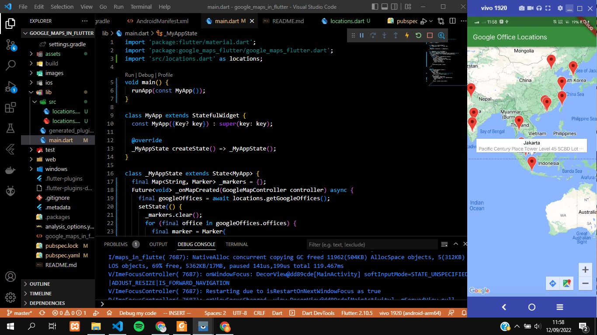
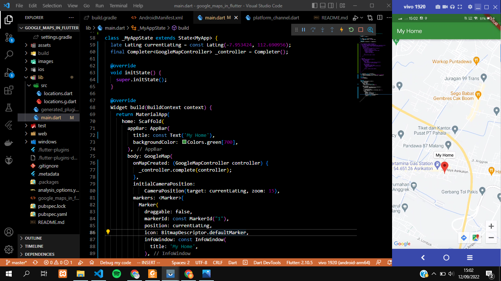

# google_maps_in_flutter

A new Flutter project.

## Menambahkan Plugin
Pada aplikasi ini akan menambahkan plugin Google Maps Flutter dengan perintah berikut ini
```
flutter pub add google_maps_flutter
``` 

## Mengkonfigurasi minSDK Android
Untuk menggunakan Google Maps SDK di Android, maka perlu merubah minSDK menjadi 20. Ubah pada file android/app/build.gradle sebagai berikut.
```
android {
    defaultConfig {
        // TODO: Specify your own unique Application ID (https://developer.android.com/studio/build/application-id.html).
        applicationId "com.example.google_maps_in_flutter"
        minSdkVersion 20                      // Update from 16 to 20
        targetSdkVersion 30
        versionCode flutterVersionCode.toInteger()
        versionName flutterVersionName
    }
}
```

## Menambahkan Google Maps ke aplikasi
### Menambahkan kunci API untuk aplikasi Android
Tambahkan API pada file AndroidManifest.xml di android/app/src/main. Tambahkan satu entri meta-data yang berisi kunci API yang dibuat. 
```
<meta-data android:name="com.google.android.geo.API_KEY" 
	android:value="YOUR-KEY-HERE"/>
``` 

### Menampilkan peta di layar
Untuk menampilkan peta pada layar maka perlu merubah lib/main.dart sebagai berikut
```
import 'package:flutter/material.dart';
import 'package:google_maps_flutter/google_maps_flutter.dart';

void main() => runApp(const MyApp());

class MyApp extends StatefulWidget {
  const MyApp({Key? key}) : super(key: key);

  @override
  _MyAppState createState() => _MyAppState();
}

class _MyAppState extends State<MyApp> {
  late GoogleMapController mapController;

  final LatLng _center = const LatLng(45.521563, -122.677433);

  void _onMapCreated(GoogleMapController controller) {
    mapController = controller;
  }

  @override
  Widget build(BuildContext context) {
    return MaterialApp(
      home: Scaffold(
        appBar: AppBar(
          title: const Text('Maps Sample App'),
          backgroundColor: Colors.green[700],
        ),
        body: GoogleMap(
          onMapCreated: _onMapCreated,
          initialCameraPosition: CameraPosition(
            target: _center,
            zoom: 11.0,
          ),
        ),
      ),
    );
  }
}
``` 

Berikut merupakan hasil dari percobaan diatas. Pada aplikasi ini akan menampilkan peta yang berpusat di Portland.


## Menempatkan Google di Peta
Hasil dari percabaan ini yaitu menampilkan kantor Google yang ada didunia. 


Untuk menampilkannya perlu menambah plugin http untuk membuat permintaan HTTP dengan mudah, plugin  json_serializable untuk mendeklarasikan struktur objek agar merepresentasikan dokumen JSON, dan build_runner sebagai dependensi waktu pengembangan.

## Tugas Praktikum
Berikut ini merupakan hasil dari tugas praktikum. Pada aplikasi ini akan menampilkan peta dengan marker yang menunjukkan posisi dari tempat tinggal saya.


